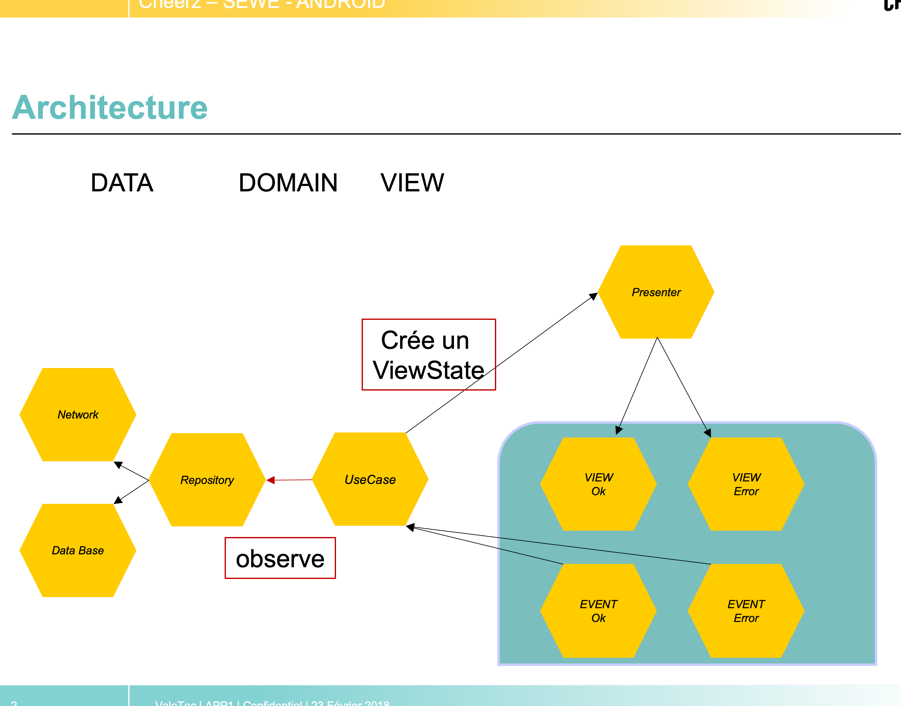
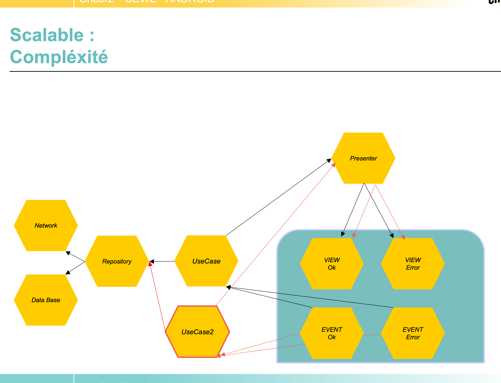

# deezer

### Out of the test :
    - J'ai pris toutes les libs des projets ou j'ai pris un peu de code (sans faire de tri)
    - Il y a une variable COLUM_NUMBER dans build.gradle (app) pour choisir le nombre de row
    - Un build Mock avec un petit jeu de fake data (toute title = nekfeu)

# Deezer Test Presentation

# BUILD SYSTEM:
    - Injection de dépendance au travers des build PROD // MOCK
        + PROD: utilise le serveur
        + MOCK: utilise des fake data pour lancer l'app sans internet

## Architecture entre le MVP // MVVM avec une pointe de MVI :

    - Un presenter pour choisir quel sub-view doit être appelé
    - Un ViewState (en guise de ViewModel)
    - Des ViewEvent, pour fire des UseCase (à la manière des Intent avec 
    les Action).

## Test.Strategie :
    - Des test Unitaire 
    - Des test de repository (avec et sans internet)
        + sans internet: test vraiment le repo
        + avec internet: test en plus les lib et le serveur

## Scalable :
    - Multiplier les ViewState avec presenter et usecase associer.
    - Permet de recoder plusieurs fois de petit bout de code.
    - DUPLIQUER? JAMAIS ! Sauf qu'en se faisant, on rend le dev plus 
    intéressant et on évite d'avoir une équipe qui disparait tous les 
    6 mois. Car le projet n'est pas agréable à coder.
    - En plus ! Permet d'avoir un mode ESSAYER facilement.
    - Permet une meilleure agilité entre les divers composant, afin de build
    des version très différente :
        + (Asi / Europe).
        + Les pub interstitiel en Angletterre sont proscrite, alors qu'elles 
        fonctionnent bien en France.

## Pane :
    - Ce que j'appelle une pane est une View Custom qui regroupe l'ensemble des composant:
         + Event, UseCase, Presenter, View.
    - Ne plus avoir besoin des fragment !! Eviter le code spagethi des fragments.

## Sans Fragment (donc sans transition de fragment aussi...) il reste :
    - Des sub-view-controller, à base de Constraint Layout avec Etat :
        + Enter / IN / EXIT qui sont 3 layout.xml
        + Avec l'api des Constraint layout, on peut AUTOMATIQUEMENT annimé les changements entre états
        + Les ViewController permettent d'avoir ces anim très facilement.
            + Ces ViewController rajoute un niveau de layer "useless"
            + Mais, on peut faire des diff entre les Etat très facilement !
            + De très belle anim, simple à maintenir (car ne sont que des KeyFrame dans un xml)
            + Ne plus avoir besoin du Context/Actvity pour load une nouvelle view (ce qui allège énormement l'architecture)
            + Oui, on perd du temps à initialiser un tel projet (car un peu d'archi à faire sans les fragment)
            + Mais pour la suite: #Productivité, #UX, #Design, #Facile_a_update

